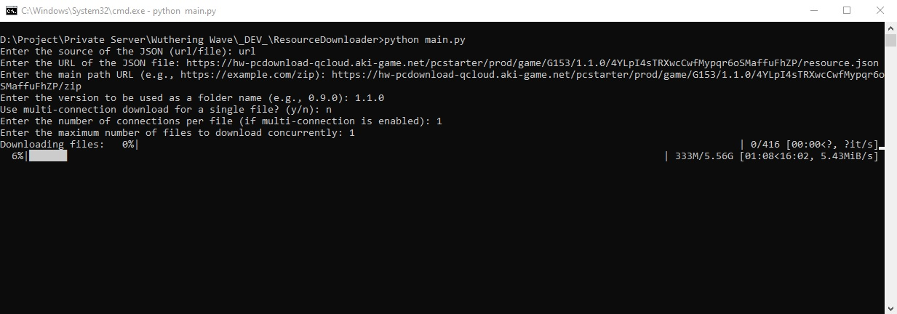

# ww-resources-downloader
A simple tool for recursively download wuthering waves resources.

# Requeriments
- Python

# Setup
1. git clone https://github.com/mrizkihidayat66/ww-resources-downloader.git
2. pip install -r requirements.txt

# Usage
> python main.py

